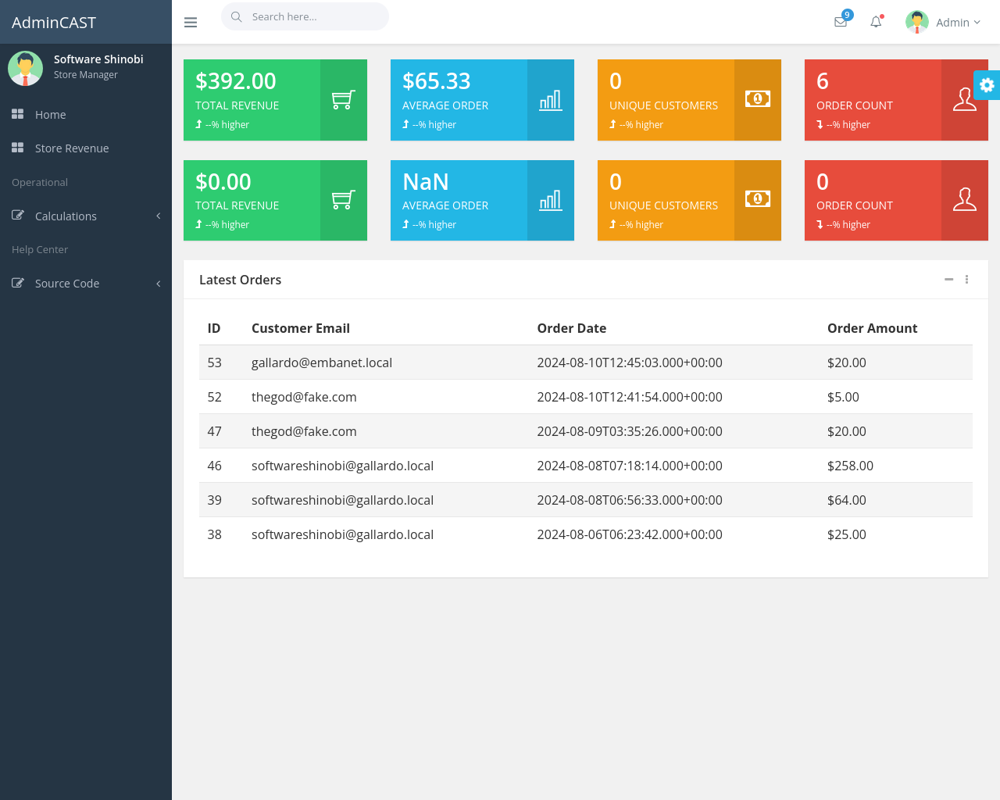

# WooCommerce Metrics & Analytics

Internet Money tastes good. And cash flow has a nice ring to it.

This project integrates with WooCommerce and WordPress to calculate store order analytics and dashboard reporting.

## release 1

the store revenue ALL TIME is calc'ing

the store reveunue CURRENT DAY is calc'ing

## release 2

cascadr integrated

Menu's cleaned up

valkryie bancolombia calculator added

portal page added

Demo data from store revenue removed

## release 3

--

### security

* readonly user at woocommerce database (ro @ mariadb)
* readonly connection to woocommerce database (ro @ spring config)

### orders

* list orders in the system
* list all orders over rolling 8 day period
* list all orders occuring today (BOG timezone)
* calculate total revenue (today, 8 days, lifetime)

## credits

https://themewagon.com/themes/free-bootstrap-4-admin-dashboard-template-admincast/

## key endpoints

http://localhost:8888/orders/revenue/average

http://localhost:8888/orders/revenue/total

http://localhost:8888/orders

